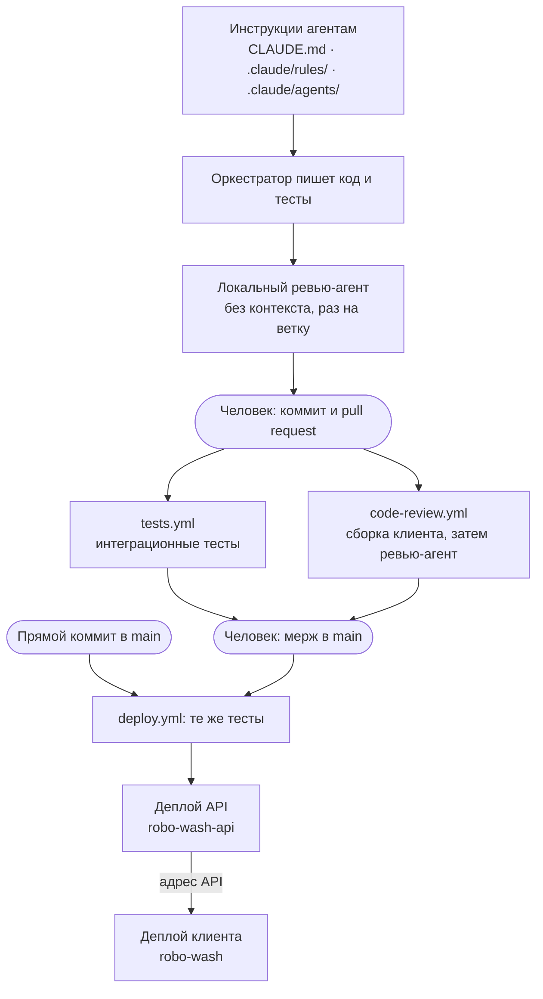

# RoboWash

Демо веб-приложение для сети автоматизированных автомоек. Интерфейс заточен под мобильные экраны.

Приложение сделано для интервью, и настоящая его задача не в мойках: показать, как автор выстраивает
мультиагентную разработку с помощью Claude Code.

**Приложение:** https://robo-wash-982643366551.europe-west4.run.app

**Переписка с агентом:** https://storage.googleapis.com/robo-wash-bucket/conversation-log.html — полный лог
работы над проектом, от постановки задачи до публикации.

> **Статус:** клиент и API опубликованы двумя сервисами Cloud Run. Локации и режимы мойки приезжают из базы,
> оплаченная мойка записывается в неё же, история читается оттуда по идентификатору устройства.
> Что сделано и что впереди — в разделе [План разработки](#план-разработки).

## Что показывает проект

- как составляется план разработки
- какой подход к использованию агентов применяется — оркестратор, субагенты и так далее
- что агентам запрещено и почему
- какой контекст агент получает, а какой намеренно нет
- как пишется CLAUDE.md: что туда попадает, а что нет
- как агенты участвуют в код-ревью и валидации кода
- где агенты не окупаются и как отсекается их шум

Как это выглядело в работе — в [переписке с агентом](https://storage.googleapis.com/robo-wash-bucket/conversation-log.html).

## Цепочка разработки

Весь репозиторий показывает одну цепочку — от инструкций, которые получают агенты, до выкатки в прод. Мойки
здесь лишь предметная область, на которой её удобно разыграть.



**Инструкции агентам.** В [CLAUDE.md](CLAUDE.md) — только то, что нужно в любой задаче: границы проекта, язык,
именование, комментарии, порядок работы. Правила бэкенда и клиента вынесены в [.claude/rules/](.claude/rules)
и подгружаются по путям: пока агент не открыл файл клиента, правила React не занимают места в его контексте.
Чек-лист ревьюера — отдельный агент [code-reviewer](.claude/agents/code-reviewer.md), оркестратору он не нужен
вовсе. На pull request экшен ревью берёт и CLAUDE.md, и всю папку `.claude/` из `main`: pull request не может
переписать правила, по которым его проверяют.

**Код пишет оркестратор, коммитит человек.** Агенты не коммитят, не открывают pull request'ы и не мержат. Тесты
идут в том же pull request'е, что и код.

**Локальное ревью.** Перед pull request'ом ветку один раз проверяет ревью-агент без контекста — по всему диффу
против `main`. Не на каждый коммит: коммит может быть фрагментом, а pull request — законченная фича. Этот прогон
закрывает два слепых пятна агента в GitHub: тот читает правила из `main` и пропускает pull request'ы, которые
меняют его собственный workflow.

**Pull request.** Параллельно стартуют два workflow. [tests.yml](.github/workflows/tests.yml) гоняет
интеграционные тесты — тот же `dotnet test`, что и локально, Postgres на время прогона поднимает Testcontainers.
[code-review.yml](.github/workflows/code-review.yml) собирает клиент (`tsc --noEmit` и Vite) и запускает
ревью-агента: находки ложатся инлайн-комментариями на строки, которых касаются, итог — одним комментарием.
Формально агент pull request не апрувит: вердикт остаётся текстом, решение за человеком.

**Мерж или прямой коммит в `main`.** [deploy.yml](.github/workflows/deploy.yml) первым делом вызывает тот же
`tests.yml` — определение тестов одно, копии нет. Красные тесты останавливают выкатку, и это же защита от коммита
мимо pull request'а. Дальше API: образ уходит в Artifact Registry, сервис `robo-wash-api` обновляется и отдаёт
наружу свой адрес. Следом клиент: он собирается уже с этим адресом и выкатывается в `robo-wash`.

## Сценарий использования

1. Карта Санкт-Петербурга с локациями моек.
2. Пользователь выбирает локацию — открывается карточка: адрес, отметка «Новое оборудование» у точек с новыми
   роботами, загрузка очереди перед шлагбаумом и список режимов мойки, каждый из которых можно развернуть
   и посмотреть программу по шагам.
3. Кнопка **«Я у терминала»** — выбор режима мойки и оплата со смартфона.
4. После оплаты — экран «Мойка в процессе» с обратным отсчётом (для теста сессия длится 5 секунд).
5. По завершении пользователь возвращается на карту и может выбрать локацию заново.
6. История моек доступна в любой момент и привязана к устройству.

## Что намеренно не делаем

Проект демонстрационный, поэтому часть функционала упрощена осознанно:

- **Прогресс мойки.** В боевой системе после оплаты клиент видит экран «Проезжайте на мойку», а событие о том,
  что мойка занята, присылает на сервер само оборудование; сервер уже транслирует прогресс клиенту (поллинг или
  веб-сокет). Здесь процесс мойки эмулируется обратным отсчётом на клиенте.
- **Аутентификация.** Нет логина, пароля и СМС. Устройство идентифицируется по `deviceId`, который хранится
  в `localStorage`; к нему же привязана история моек.
- **Оплата.** Нажатие «Оплатить» сразу считается успешной оплатой, платёжный провайдер не подключается.
- **Бонусы.** Не реализуем.

## Стек

| Слой | Технология |
| --- | --- |
| Клиент | React + TypeScript (Vite), карта — 2GIS MapGL (`@2gis/mapgl`) |
| API | ASP.NET Core Web API (.NET 10) |
| База | PostgreSQL + EF Core |
| Тесты | xUnit — интеграционные тесты API |
| Сборка | Docker: у клиента и API свои образы и свои Dockerfile |
| CI/CD | GitHub Actions |
| Хостинг | Google Cloud Run: два сервиса, `robo-wash` и `robo-wash-api`. База — Postgres в Neon |

Из базы читаем список локаций и карточку выбранной, пишем сессии моек, отдаём историю по `deviceId`.
Нагрузки нет, поэтому схема простая: клиент → API → база.

Ключ 2GIS в репозитории не хранится. Локально он лежит в `src/robo-wash-react/.env` в переменной
`VITE_2GIS_MAP_KEY` (шаблон — `.env.example` рядом). Важно: Vite подставляет `VITE_*` на этапе сборки и запекает
значение в бандл, поэтому в CI ключ передаётся аргументом в `docker build`, а не переменной окружения Cloud Run —
до собранной статики она не доедет. Тем же путём едет и адрес API в `VITE_API_BASE_URL`.

## Структура репозитория

```
src/RoboWash.slnx         солюшн: Api и xUnit, клиент в него не входит
src/RoboWash.Api/         контроллеры, сервисы, EF Core (DbContext, сущности, контракты) и свой Dockerfile
src/RoboWash.xUnit/       интеграционные тесты: API поднимается над одноразовым Postgres в контейнере
src/robo-wash-react/      клиент, открывается отдельно в VS Code; свой Dockerfile и шаблон конфига nginx
db/                       SQL-скрипт, который разворачивает базу с нуля: таблицы, затем справочные данные
.github/workflows/        CI (тесты, сборка клиента, агент код-ревью) и CD (тесты, затем деплой обоих сервисов)
CLAUDE.md                 инструкции агентам, нужные в любой задаче
.claude/rules/            правила по частям кода — бэкенд и клиент; подгружаются, только когда работа их касается
.claude/agents/           ревью-агент: что считается находкой и как о ней сообщать
```

## Локальный запуск

БД: Схема и справочные данные:

```bash
psql -U postgres -f db/create-database.sql
```

Скрипт [db/create-database.sql](db/create-database.sql) создаёт базу `robowash`, все таблицы и справочные
данные — семь точек и три режима мойки. Он рассчитан на чистый сервер и падает, если база уже
существует: приводить существующую базу к нужному виду — работа миграций.
Новые таблицы добавляются и в миграцию, и в этот скрипт, иначе развернуть проект с нуля станет нечем.

Строка подключения для разработки лежит в `appsettings.Development.json` и ждёт базу на localhost под
пользователем `postgres`. Если пароль у вас другой, переопределите её переменной окружения
`ConnectionStrings__RoboWash`, а файл в репозитории не трогайте.

API (`https://localhost:7228` и `http://localhost:5287`, описание OpenAPI на `/openapi/v1.json`).
Прокси клиента ходит на 5287 — этот адрес слушают оба профиля запуска:

```bash
dotnet run --project src/RoboWash.Api
```

Клиент (`http://localhost:5173`). Запросы к API идут через прокси Vite, поэтому API должен быть уже запущен —
иначе на карте не будет точек:

```bash
npm --prefix src/robo-wash-react run dev
```

Тесты:

```bash
dotnet test src/RoboWash.slnx
```

Образы целиком — тем же способом, каким их собирает CI. API берёт строку подключения из переменной
окружения, клиенту адрес API запекается в бандл аргументом сборки:

```bash
docker build -t robo-wash-api src/RoboWash.Api
```

```bash
docker run -p 8081:8080 -e ConnectionStrings__RoboWash="Host=host.docker.internal;Database=robowash;Username=postgres;Password=пароль" robo-wash-api
```

```bash
docker build -t robo-wash --build-arg VITE_2GIS_MAP_KEY=ключ --build-arg VITE_API_BASE_URL=http://localhost:8081 src/robo-wash-react
```

```bash
docker run -p 8080:8080 robo-wash
```

Клиент из контейнера приходит к API с чужого origin, поэтому тот должен его разрешить: список лежит
в `appsettings.json`, а переопределяется переменной `Cors__AllowedOrigins__0`.

## Деплой

Google Cloud, регион `europe-west4`: образы в Artifact Registry, два сервиса в Cloud Run (serverless,
автоскейл). `robo-wash` — nginx с собранной статикой, `robo-wash-api` — ASP.NET Core.

Одним образом клиент и API не собираются намеренно. Над клиентом может работать отдельная команда, а в API
кроме браузера пойдут мобильные приложения: общий образ связал бы их релизы без нужды. Цена решения — CORS:
клиент приходит с чужого домена, и список разрешённых origin'ов лежит в `appsettings.json` сервера.

Строка подключения к базе в репозитории не хранится. Она лежит в Secret Manager под именем
`ConnectionStrings__RoboWash` и привязана к сервису `robo-wash-api`: ASP.NET Core читает её из переменной
окружения, а двойное подчёркивание в имени означает вложенность в конфигурации.

## План разработки

Каждая часть функционала — отдельная feature-ветка.

- [x] React/TypeScript клиент: карта Санкт-Петербурга, локации и карточка локации
- [x] Сценарий мойки: «Я у терминала», выбор режима, оплата, обратный отсчёт, возврат на карту
- [x] История моек, меню и страница «О приложении»
- [x] Dockerfile: клиент собирается в статику, отдаёт её nginx
- [x] GitHub Actions: агент код-ревью на каждый pull request
- [x] Интеграционные тесты в пайплайне: на pull request и первым шагом перед деплоем
- [x] Автоматический деплой в Cloud Run при пуше в `main`
- [x] Лог переписки с агентом отдельной страницей
- [x] Проектирование структуры базы
- [x] Солюшн бэкенда: `RoboWash.Api` + `RoboWash.xUnit`, отдаём список локаций из базы
- [x] Клиент и API — двумя сервисами Cloud Run, база в Neon
- [x] Привязка к `deviceId`: пишем сессии мойки, историю отдаём из базы
- [x] Инструкции агентам разделены: CLAUDE.md для любой задачи, правила по путям, отдельный ревью-агент
